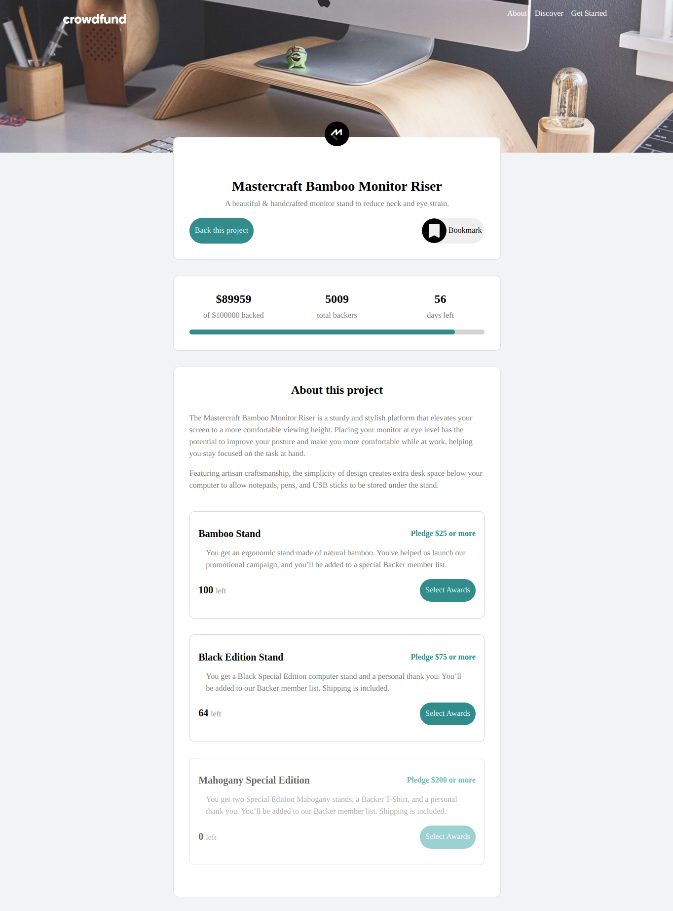

# Frontend Mentor - Crowdfunding product page solution

This is a solution to the [Crowdfunding product page challenge on Frontend Mentor](https://www.frontendmentor.io/challenges/crowdfunding-product-page-7uvcZe7ZR).

## Table of contents

- [Overview](#overview)
  - [The challenge](#the-challenge)
  - [Screenshot](#screenshot)
  - [Links](#links)
- [My process](#my-process)
  - [Built with](#built-with)
  - [What I learned](#what-i-learned)
- [Author](#author)

## Overview

### The challenge

Users should be able to:

- View the optimal layout depending on their device's screen size
- Make a selection of which pledge to make
- See an updated progress bar and total money raised based on their pledge total after confirming a pledge
- See the number of total backers increment by one after confirming a pledge
- Toggle whether or not the product is bookmarked

### Screenshot

### Links

- Solution URL: [Solution URL](https://github.com/winay05/crowdfunding-product-page)
- Live Site URL: [Live site URL](https://crowdfunding-frontpage.netlify.app)

## My process

### Built with

- CSS custom properties
- Flexbox
- Mobile-first workflow
- React - JS library
- Bootstrap - For styles

For the time being, I made a file to store the data, so that the same solution can be extened when other projects needs to be added or the data needs to be fetched from some API.

### What I learned

- Planning layouts
- Component interactons
- Lifting state up
- Continuous deployment.

More importantly, making MVP within a short duration.

## Author

- Website - [Vinay Kumar Dahiya](https://vinaykumardahiya-portfolio.netlify.app/)
- Frontend Mentor - [@winay05](https://www.frontendmentor.io/profile/winay05)
